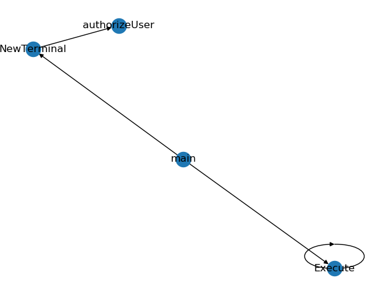

## repo-mapper-go
---
- `Usage`
```
python3 index.py -f ./go-repo/sample.go
```

- `Sample Output`



- `Note` : go formatted codes are preferred
```
gofmt -w <filename>
```

### Pending Tasks
---
- [ ] collect result of multiple files and map fuction references for whole repo
- [ ] concept of struct
- [ ] function stored in a variable
- [ ] provide option for just comment removal
